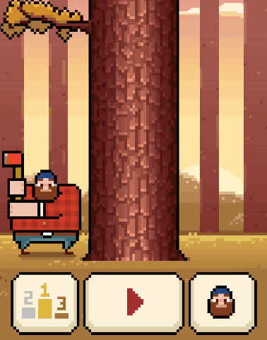

# timber-Game1
A simple Timberman-style arcade game clone built using C++ and the SFML library.

## Gameplay

## Controls
Keys: left & right arrow, enter and esc button

## Technologies Used
C++  /  SFML (Simple and Fast Multimedia Library)  /  VS Code /  MinGW / GCC Compiler

